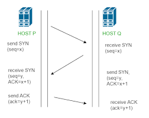

## Three-way handshake
**Nama** : Aulia Ilham Nur Alfian  
**NRP** : 3122600024  
**Kelas** : 2 D4 IT A  
**Mata Kuliah** : Konsep Jaringan  
`Semua Tugas dalam repo ini merupakan tugas mata kuliah Konsep Jaringan yang dibimbing oleh Bpk. Dr. Ferry Astika Saputra,ST, M.Sc`

<strong>Gambar:</strong> Three way handshake

Tiga langkah dalam Three-way handshake adalah fondasi penting dalam menjalin koneksi TCP yang andal antara klien dan server. Mari kita telaah masing-masing langkah dengan lebih rinci:

**Langkah 1 - Permintaan Koneksi (SYN):**

Ketika klien ingin memulai koneksi dengan server, langkah pertama yang dilakukan adalah mengirim pesan SYN. Pesan ini berfungsi sebagai permintaan untuk memulai koneksi. Dalam pesan SYN, klien mengirimkan beberapa informasi penting kepada server, termasuk nomor urutan (sequence number) yang akan digunakan untuk mengidentifikasi setiap byte data dalam pertukaran. Juga disertakan ukuran jendela (window size) yang menunjukkan berapa banyak byte data yang dapat diterima oleh klien sekaligus. Flag SYN diatur dalam header pesan untuk menunjukkan bahwa ini adalah permintaan koneksi awal.

**Langkah 2 - Persetujuan Koneksi (SYN + ACK):**

Server menerima pesan SYN dari klien dan merespons dengan mengirimkan pesan SYN-ACK kembali ke klien. Pesan SYN-ACK ini adalah respons dari server yang menunjukkan bahwa server bersedia untuk menjalin koneksi. Pesan ini juga mengandung informasi yang relevan, termasuk nomor urutan yang diambil dari pesan SYN klien, dan acknowledgment number yang merupakan nomor urutan dari pesan SYN klien ditambah satu. Selain itu, ukuran jendela juga disertakan dalam pesan ini. Flag SYN dan ACK diatur dalam header pesan untuk menandakan tanggapan terhadap permintaan koneksi awal dari klien.

**Langkah 3 - Konfirmasi Koneksi (ACK):**

Ketika klien menerima pesan SYN-ACK dari server, klien mengirimkan pesan ACK sebagai konfirmasi bahwa pesan SYN-ACK telah diterima. Dalam pesan ACK, acknowledgment number digunakan untuk menunjukkan nomor urutan dari pesan SYN-ACK server ditambah satu. Ini menandakan bahwa klien telah menerima respon dari server dan koneksi telah berhasil terbentuk. Pada titik ini, klien dapat mulai mengirimkan data. Koneksi dianggap stabil dan siap untuk pertukaran data lebih lanjut.

Melalui tiga langkah ini, klien dan server berhasil menjalin koneksi yang dapat diandalkan dalam lingkungan jaringan. Kedua belah pihak memiliki pemahaman bahwa koneksi telah diinisiasi dan dikonfirmasi dengan benar. Jika salah satu langkah dalam Three-way handshake tidak berhasil, koneksi tidak akan terbentuk, dan langkah-langkah ini akan diulang atau pesan kesalahan akan dikirimkan sesuai kebutuhan.

Dengan demikian, Three-way handshake merupakan protokol penting dalam memastikan bahwa koneksi TCP antara perangkat berjalan dengan lancar dan andal sebelum pertukaran data dimulai.
